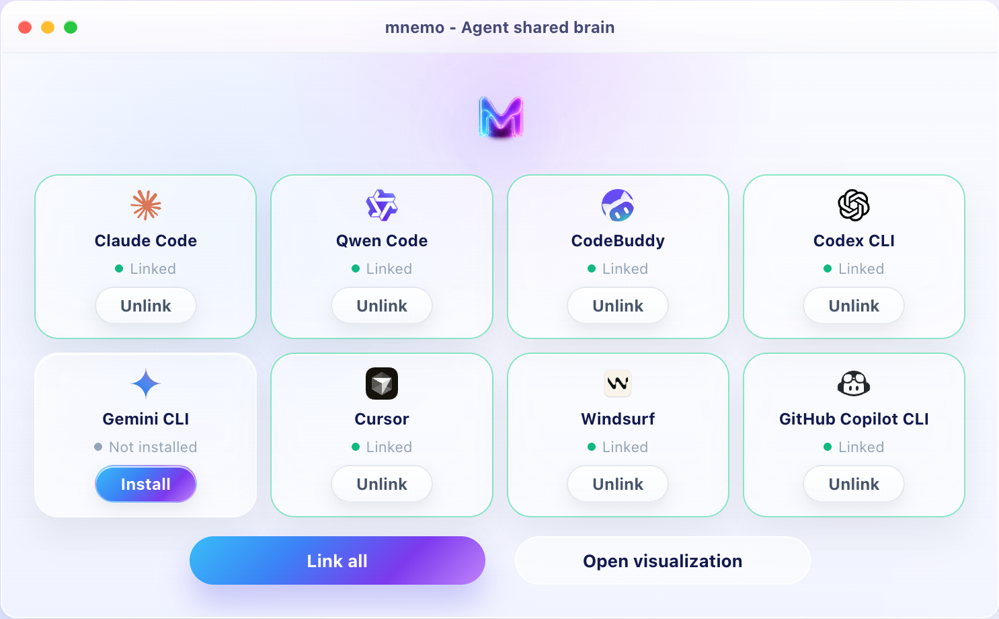
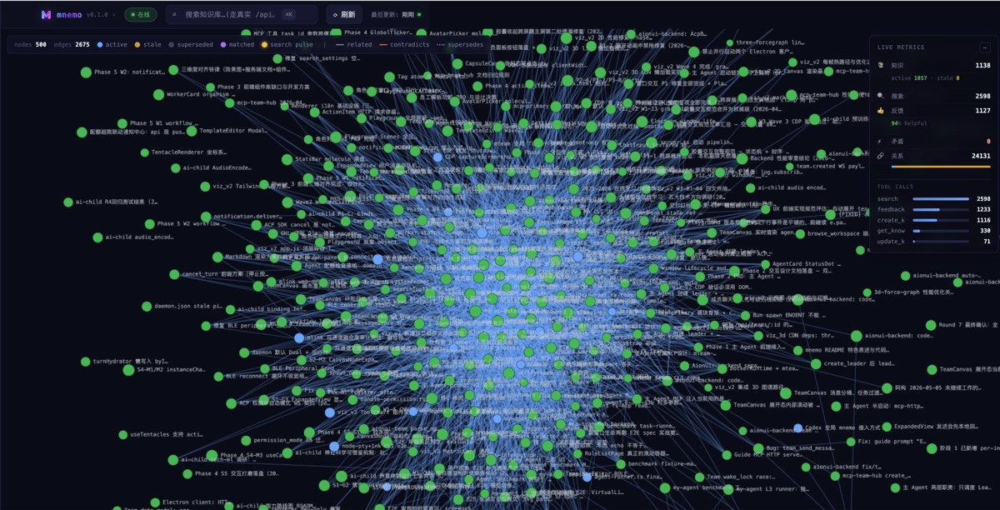

<p align="center">
  
</p>

<h1 align="center">mnemo</h1>
<p align="center"><strong>The desktop client for giving AI agents local memory.</strong></p>
<p align="center">Install the client, link your agent tools, and keep your memory as your own local asset.</p>

<p align="center">
  <a href="#why-mnemo">Why</a> •
  <a href="#start-with-the-desktop-client">Client</a> •
  <a href="#features">Features</a> •
  <a href="#quick-start">Quick Start</a> •
  <a href="#watch-your-agents-brain-form">Visualization</a> •
  <a href="#the-endgame-memory-without-tool-calls">Endgame</a> •
  <a href="README.zh.md">中文</a>
</p>

<p align="center">
  <a href="https://modelcontextprotocol.io"></a>
  
  
  
</p>

---

## Start with the desktop client

mnemo is now easiest to use as a desktop client.

Install the app, open it, and link the AI tools you already use. The desktop client bundles the `mnemo` CLI, so installing the client also gives agents the local MCP server they need.

<p align="center">
  
</p>

The client is the control surface:

- **Install once**: the app ships with the local `mnemo` CLI inside it.
- **Link agents**: connect Claude Code, Claude Desktop, Cursor, Codex CLI, Qwen Code, Gemini CLI, CodeBuddy, Windsurf, and GitHub Copilot CLI.
- **Own your data**: memories live locally in your mnemo database instead of being locked inside one vendor's chat history.
- **Use the CLI when needed**: advanced users and agents can still call `mnemo` directly.

mnemo is not trying to be another hosted note app. It is an agent-first memory layer where your project rules, corrections, preferences, and lessons remain a user-owned asset that agents can reuse.

## Why mnemo

Every new agent session wakes up almost blank.

It does not remember what you corrected last time, what this project refuses to do, which workaround already failed, or which path already cost you an afternoon.

Most memory tools answer with: store it, search it later.

That helps, but it is not enough.

Real memory should not need to be stuffed into prompts forever. It should not cost another tool call every time. An agent that truly evolves should turn repeated project rules, user preferences, tool habits, failure lessons, and successful workflows into long-term behavior.

That is what mnemo is for:

```text
Not to make agents call memory tools forever.
But to help agents evolve memory from experience.
```

## What is mnemo?

mnemo is an agent-first local memory system.

Today, it gives agents a local hippocampus through MCP:

- **Searchable**: hybrid full-text, semantic, and graph search.
- **Feedback-aware**: agents can mark used knowledge as helpful, misleading, or outdated.
- **Correctable**: stale, contradictory, duplicate, and weak memories do not pollute results forever.
- **Observable**: knowledge, relations, feedback, lifecycle state, and agent activity stay visible locally.
- **Client-first**: shipped as a desktop app with the CLI bundled inside; no Python, pip, npm, or source install for end users.

Tomorrow, mnemo will distill stable, valuable, repeatedly validated memories into training samples and train local LoRA / Adapter layers during idle time.

In short:

```text
Today: MCP lets agents retrieve memory.
Tomorrow: LoRA lets the model remember.
Endgame: agents evolve through every experience.
```

## Why mnemo is different

- **Memory is a lifecycle, not a note**
  - Memories are created, used, rated, corrected, superseded, and archived instead of piling up forever.

- **Agents are first-class users**
  - mnemo is not just a human-facing knowledge base. It ships agent-facing contracts that tell agents when to search, write, update, archive, and give feedback.

- **Search is also maintenance**
  - Search can return a small cleanup task, so the memory base improves while agents do real work.

- **Correction is not an afterthought**
  - `feedback`, `write gate`, `supersede`, `contradiction`, and `archive` are normal operations.

- **Memory can be trained**
  - The endgame is not to keep memories in context forever, but to turn high-quality experience into local model behavior.

- **Agents can keep evolving**
  - Every correction, successful task, and tool habit can become raw material for the next behavior upgrade.

## Features

- **Desktop client first**: install mnemo as an app, then link or unlink agent clients from one place.
- **Bundled CLI**: the desktop client includes the `mnemo` CLI, so agents can still use stdio MCP and local commands.
- **MCP-native agent contract**: works with Claude Code, Claude Desktop, Cursor, Codex CLI, Qwen Code, Gemini CLI, CodeBuddy, Windsurf, GitHub Copilot CLI, and MCP-compatible clients.
- **Hybrid search**: FTS5 full-text search + sqlite-vec semantic search + typed knowledge graph, fused via Reciprocal Rank Fusion.
- **Search-time maintenance tasks**: search results can include one relevant cleanup task, such as archiving stale knowledge or cleaning duplicates.
- **Knowledge lifecycle**: entries move through `active`, `stale`, `superseded`, and `archived`.
- **Feedback-aware ranking**: agents record `helpful`, `misleading`, or `outdated` after using knowledge, and that signal feeds future trust.
- **Write gate**: near-duplicate, weak-evidence, and potential contradiction checks run before writes.
- **Auto-linking**: vector similarity, keywords, wikilinks, manual links, and feedback-driven weights build a local knowledge graph over time.
- **Contradiction surfacing**: conflicting entries are returned together with `contradicts_with` instead of being hidden behind an embedding result.
- **Local visualization**: list, 2D Canvas, and 3D WebGL views show entries, relations, and recent agent activity.
- **Timeline API**: replay knowledge and agent activity over time.
- **Zero infrastructure**: one local SQLite database, optional Ollama embeddings, no hosted service required.

## Quick Start

mnemo ships through GitHub Releases as prebuilt desktop clients and CLI binaries.

**End users do not need Python, pip, npm, or a source checkout.**

### Recommended: install the desktop client

Download the package for your platform from the latest release:

| Platform | Recommended package |
|----------|---------------------|
| macOS Apple Silicon | [`mnemo-desktop-macos-arm64.dmg`](https://github.com/zhuqingyv/mnemo/releases/latest/download/mnemo-desktop-macos-arm64.dmg) |
| macOS Intel | [`mnemo-desktop-macos-x86_64.dmg`](https://github.com/zhuqingyv/mnemo/releases/latest/download/mnemo-desktop-macos-x86_64.dmg) |
| Linux x86_64 | [`mnemo-desktop-linux-x86_64.AppImage`](https://github.com/zhuqingyv/mnemo/releases/latest/download/mnemo-desktop-linux-x86_64.AppImage) |
| Windows x86_64 | [`mnemo-desktop-windows-x86_64.exe`](https://github.com/zhuqingyv/mnemo/releases/latest/download/mnemo-desktop-windows-x86_64.exe) |

After opening the app:

1. Let mnemo detect your installed AI clients.
2. Click **Link** for the agents you want to connect.
3. Restart the linked AI client if it was already open.
4. Ask the agent to use mnemo memory.

The desktop app includes the local `mnemo` CLI resource, so the linked agent can start `mnemo mcp` without you installing Python or building from source.

### CLI-only fallback

If you only want the standalone CLI binary, use the install script.

#### macOS / Linux

```bash
curl -fsSL https://github.com/zhuqingyv/mnemo/releases/latest/download/install.sh | sh
```

#### Windows (PowerShell)

```powershell
irm https://github.com/zhuqingyv/mnemo/releases/latest/download/install.ps1 | iex
```

The CLI installer drops the binary into `~/.mnemo/bin` (POSIX) or
`%LOCALAPPDATA%\mnemo\bin` (Windows), adds it to your PATH, and runs
`mnemo setup --auto` so every detected AI client gets the mnemo MCP server and the agent system prompt configured automatically.

Supported clients: **Claude Code**, **Claude Desktop**, **Cursor**, **Codex CLI**, **Qwen Code**, **Gemini CLI**, **CodeBuddy**, **Windsurf**, and **GitHub Copilot CLI**.

After installation, restart your AI client. If you installed the CLI-only path, verify:

```bash
mnemo --version
mnemo --help
```

### Hand the repo to your local agent

If you want a coding agent to install mnemo for you, just clone this repo and tell it to follow [AGENTS.md](AGENTS.md) — it has the release-only install rules and the "do not pip install" guardrails baked in.

### Re-run / uninstall

```bash
mnemo setup --auto       # idempotent, safe to run any time
mnemo setup --dry-run    # preview what would change
mnemo setup --uninstall  # remove every mnemo entry from every client
```

### Optional: HTTP transport for multi-client / visualization

By default `mnemo setup` writes stdio MCP entries (clients spawn
`mnemo mcp` directly, zero background process). To share one mnemo across
multiple clients or to use the live visualization, switch to HTTP:

```bash
mnemo setup --mode http --port 8787
mnemo serve --port 8787
open http://127.0.0.1:8787/viz/
```

## Usage

Most users should start from the desktop client: link the agents you use, then let the agent call mnemo through MCP.

For agent and advanced CLI workflows, mnemo provides 11 MCP tools:

| Tool | Description |
|------|-------------|
| `search` | Hybrid full-text + semantic + graph search across all knowledge |
| `create_knowledge` | Write a new structured entry (with write-gate dedup check) |
| `get_knowledge` | Fetch full content by id or title |
| `update_knowledge` | Amend an existing entry (old version becomes superseded) |
| `delete_knowledge` | Hard-delete an entry by id |
| `feedback_knowledge` | Record `helpful` / `misleading` / `outdated` signal |
| `archive_knowledge` | Soft-hide from search without deleting |
| `unarchive_knowledge` | Restore an archived entry |
| `get_related` | Traverse the knowledge graph from an entry |
| `list_tags` | List all tags, optionally filtered by scope |
| `search_by_tag` | Find entries matching all given tags |

The CLI is available because it is bundled with the client and also published as a standalone binary:

```bash
mnemo search "websocket heartbeat"
mnemo create --title "Deploy needs --chain flag" \
  --tags "deploy,gotcha" --summary "Without --chain, tx silently drops" \
  --body "Deploy script ignores pending tx unless --chain is passed." \
  --claim-type fact
mnemo get 42
mnemo tags
```

Core concepts:

- **Claim types** — `fact` | `decision` | `procedure` | `hypothesis`
- **Scopes** — `global` | `project` | `session`
- **Agent workflow** — search first, use or inspect results, do the work, write back non-obvious knowledge, then give feedback on entries that affected the result
- **Search dispatch** — search may append one optional maintenance task for the agent to handle when it matches the current context
- **Feedback loop** — agents call `feedback_knowledge` with `helpful`, `misleading`, or `outdated` after using a result

## Watch your agent's brain form

mnemo does not just store memory in a database. It makes memory visible before it becomes internalized.

You can watch agent experience cluster into a graph, see search blend full-text, semantic, and relational signals, and inspect why each memory should still be trusted.

```bash
mnemo serve --port 8787
open http://127.0.0.1:8787/viz/
```

### Memory graph: experience grows connections

The 2D graph shows the memory network agents maintain: entries cluster through typed relations, feedback, and recent activity instead of becoming a flat note list.

<p align="center">
  
</p>

### Search interface: not notes, memory activation

The search interface combines full-text, semantic, and graph signals with real-time ranking and maintenance task dispatch. Agents do not just get answers; they can improve the memory base while working.

<p align="center">
  
</p>

### Detail panel: every memory has a trust file

The detail panel keeps each memory inspectable. Status, scope, source, tags, feedback, lifecycle events, and related entries stay close to the content, so agents and humans can audit why a memory should still be trusted.

<p align="center">
  
</p>

### 3D graph: memory grows from a plane into space

The 3D view turns the memory network into a spatial structure you can rotate, explore, and inspect by cluster. It shows which experiences have formed a stable core and which memories are still waiting for stronger evidence.

<p align="center">
  
</p>

mnemo makes memory visible, then internalizes it, then helps agents evolve.

First, you watch the graph grow. Then, you watch agents use it. Eventually, the best parts are distilled into the model itself and become the next smarter reaction.

## The endgame: memory without tool calls

MCP memory is the first layer.

It gives agents a local hippocampus they can search, update, and correct. But retrieval is not the final form of memory.

mnemo's goal is to turn repeated experience into model behavior.

When an agent keeps seeing the same project rule, user preference, tool pattern, or correction, mnemo should not keep returning it as another search result forever.

mnemo should distill it, evaluate it, version it, and train it into a local LoRA / Adapter.

Eventually, your agent should not call a tool to remember how you work.

It should just know.

This is the evolution path mnemo is aiming for:

```text
External retrieval
  ↓
Local memory
  ↓
Rumination distillation
  ↓
Model internalization
  ↓
Agent behavior evolution
```

```text
External experience
  ↓
Short-term memory
  ↓
Rumination distillation
  ↓
Training samples
  ↓
LoRA / Adapter
  ↓
Long-term behavior bias
```

The fuller pipeline:

```text
Event Log
  ↓
Working Memory
  ↓
Memory Candidate Pool
  ↓
Distiller
  ↓
Training Dataset Registry
  ↓
Rumination Job
  ↓
Eval Gate
  ↓
LoRA Registry
  ↓
Runtime Loader
```

This does not mean using LoRA to memorize every fact.

Concrete docs, logs, numbers, and history still belong in RAG / MCP retrieval. LoRA is better for internalizing user preferences, behavior style, stable project rules, agent work habits, and repeated correction patterns.

In one line:

```text
RAG remembers facts. mnemo trains habits.
```

## Architecture

```text
Desktop client ─┐
MCP client ─────┼──▶ mnemo service ──┬──▶ FTS5 (BM25)
CLI ────────────┘                    ├──▶ sqlite-vec (semantic)
                                     └──▶ relation graph (typed edges)
                                      ▼
                              SQLite single file
```

The current system keeps core data in one local SQLite file. Knowledge, relations, feedback, events, lifecycle state, and vector indexes stay inspectable, portable, and backup-friendly.

The long-term roadmap moves toward rumination-based memory internalization:

```text
mnemo = an agent's hippocampus + sleep rumination system + memory distiller + LoRA training factory + memory version registry
```

## Configuration

All settings are environment variables prefixed with `MNEMO_`:

| Variable | Default | Purpose |
|----------|---------|---------|
| `MNEMO_DATA_DIR` | `~/.mnemo` | Database location |
| `MNEMO_EMBEDDING_MODEL` | `qwen3-embedding:0.6b` | Ollama embedding model |
| `MNEMO_OLLAMA_URL` | `http://localhost:11434` | Ollama endpoint |
| `MNEMO_DEFAULT_SCOPE` | `global` | Default scope for new entries |

Feature flags:

```text
MNEMO_WRITE_GATE_ENABLED
MNEMO_FRESHNESS_ENABLED
MNEMO_STATE_MACHINE_ENABLED
MNEMO_FEEDBACK_LOOP_ENABLED
MNEMO_CONTRADICTION_PAIR_ENABLED
MNEMO_CONTEXT_AWARE_RANK_ENABLED
```

All default to `true` (except context-aware rank). Set any to `false` to disable without code changes.

## Development

End users do **not** install mnemo from source — see [Quick Start](#quick-start)
for the binary path. The instructions below are for contributors.

Prerequisites: Python 3.11+ and (optionally) [Ollama](https://ollama.ai)
with `qwen3-embedding:0.6b` for vector search.

```bash
git clone https://github.com/zhuqingyv/mnemo.git
cd mnemo
python -m venv .venv && source .venv/bin/activate
pip install -e ".[dev]"
pytest tests/
```

Regression gate (must pass before merge):

```bash
MNEMO_HYBRID=1 python scripts/phase3_regression_gate.py
```

Build a local binary:

```bash
pip install pyinstaller
scripts/build.sh        # macOS / Linux
# Windows: python -m PyInstaller mnemo.spec --noconfirm --clean
```

## Contributing

See [CONTRIBUTING.md](CONTRIBUTING.md).

## License

MIT — see [LICENSE](LICENSE).

---

Built on the [Model Context Protocol](https://modelcontextprotocol.io) by Anthropic.
